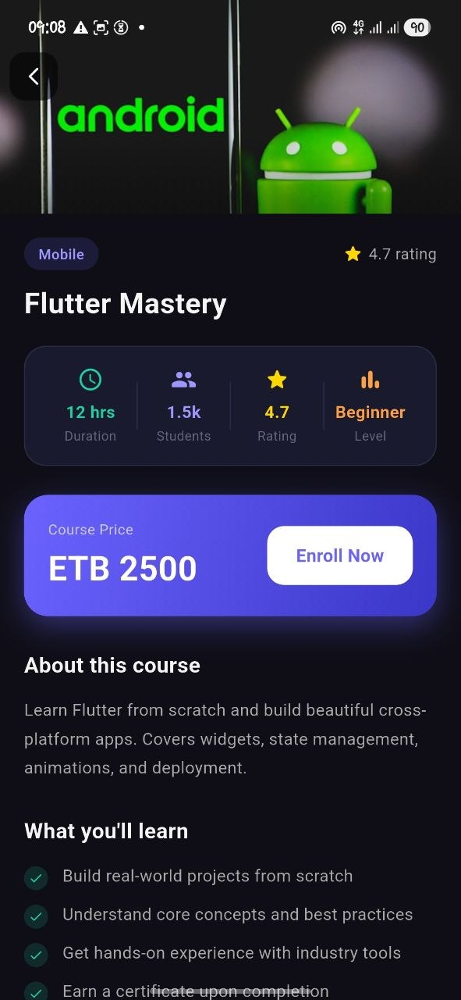

# Fluent — Course Learning App

A mobile-first Flutter app built for the Fluentian Internship Programme (Task 4, Round 1). Users can browse courses, view details, and track their learning progress.

---

## Screens

- **Dashboard** — App name, quick stats, featured courses, recently viewed, and recommended courses
- **Courses Listing** — All courses with search, category filter, and sort options
- **Course Detail** — Full course info with enroll action

---

## Features

- Browse and search courses by title or description
- Filter by category (Mobile, Web, AI, Design, etc.)
- Sort by rating, popularity, price, or duration
- Recently viewed courses tracked automatically
- Shimmer loading skeletons while data loads
- Smooth fade transitions between screens
- Press-scale touch animation on course cards
- Pull-to-refresh on dashboard
- Fully responsive mobile layout

---

## How to Run Locally

**Requirements**
- Flutter SDK 3.x
- Dart SDK 3.x
- Android Studio or VS Code with Flutter extension

**Steps**

```bash
# Clone the repository
git clone https://github.com/arsema16/fluentian.git

# Navigate into the project
cd fluentian

# Install dependencies
flutter pub get

# Run the app
flutter run
```

---

## Build APK

```bash
flutter build apk --release
```

Output: `build/app/outputs/flutter-apk/app-release.apk`

---

## Packages Used

| Package | Version | Purpose |
|---|---|---|
| `http` | ^1.1.0 | API requests |
| `shimmer` | ^3.0.0 | Loading skeleton animations |
| `cupertino_icons` | ^1.0.8 | iOS-style icons |

---

## Project Structure

```
lib/
├── core/
│   └── theme/          # App colors and theme
├── data/
│   └── mock_courses.dart   # Mock course data
├── models/
│   └── course.dart         # Course data model
├── screens/
│   ├── dashboard/          # Home/Dashboard screen
│   └── courses/            # Courses list + detail screens
├── services/
│   ├── api_service.dart    # API service (with web/IO split)
│   └── recently_viewed.dart # Recently viewed tracker
├── widgets/
│   ├── course_card.dart    # Reusable course card
│   ├── shimmer_card.dart   # Loading skeleton card
│   └── section_title.dart  # Section header widget
└── main.dart
```

---

## State Management

Flutter built-in — `setState` and `FutureBuilder`. No external state management package is used, keeping the codebase simple and readable for a project of this scope.

---

## Data

Course data is served from a mock local list (`mock_courses.dart`) with a simulated network delay. On non-web platforms, the app attempts to fetch from a real API and falls back to mock data automatically.

---

## Screenshots

| Dashboard | Courses | Detail |
|---|---|---|
|  |  |  |

---

## Author

Built by [Arsema Tefera] for the Fluentian Internship Programme — Task 4, Round 1.
